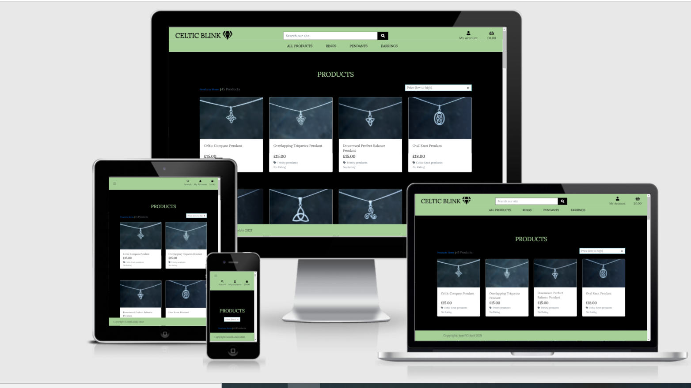

# Celtic Blink-E commerce jewellery store
##  Code created by Kamila Golebiowska for Code Institute
## Languages used: HMTL, CSS, Javascript, Python, Bootstrap, Django, AWS

[Celtic Blink Live Page](https://celtic-blink-ms4.herokuapp.com/)

## Project description and goals:

Celtic Blink is a online jewellery store, where you can purchase various celtic designs. Main goal is to sell items and provide a pleasant shopping experience for user. 

### Navigation Bar & Footer  

Navigation Bar will contain the dropdown list with the categories of product, search field and the user section with the cart and menu for registration and login and profile.
Footer will be pretty basic, containing the copyright only. It will have colors matching the navigation bar. 

### Home Page:

Homepage is just an invitation to shop with a background image that shows examples of the silver s
jewellery with a button that takes us to the products page.

## Prodcut page:

For displaying products I used black color, so the jewellery looks more elegant.

### Product Detail 

### Register/Login

 

### Features to add in future
 * sales and reduction 
 * delivery options
 * contact form, so customers can easily communicate with us.

 ## User Goals

 ### First Time User:
 * to check and see the selection of products
 * to sort through products
 * to view the individual products
 * easily buy items and see them in my cart, includin the price
 * to register easily for an account
 * have a personal profile
 * to review the particular products
 * to make a payments easily
 * ability to review and add products to my favourites

### Returning User
* to login to my profile
* to have my orders stored
* to have faster checkout options
* to check and see the selection of products
* to sort through products
* to view the individual products

 

## Wireframes
 [Wireframes](https://drive.google.com/file/d/1Zp4Ugv5y7n7yqxUU71eGvz-5pVit7xpv/view?usp=sharing)

## Credits

### Content

All text content was written by me-Kamila Golebiowska. 

### Images 
The images for the website and products were taken from my work. The credit for them goes to Celtic Design Scotland(jewellery business), where I currently work.

### Icons and Fonts

Logo and Icons used free icons from [Font Awesome](https://fontawesome.com/?from=io)
Font was taken from Google Fonts
Favicon was taken from [Favicon](https://www.websiteplanet.com/webtools/favicon-generator/)

### Code

Most of the code comes from the Code Institute walkthrough Boutique Ado project. I made some chages with style, but mantained the same structure, as it worked for my project perfectly. 
The seperate models that were to be made independently were taken from , isnpired or modified from the mainly  you tube tutorials. Additionaly I followed Slack threads for some solutions and opinions.
 
* [Stack Overflow](https://stackoverflow.com/)
* [Django documentation](https://docs.djangoproject.com/en/4.0/)
* [Django secret Key generator](https://djecrety.ir/)
* [Stripe](https://stripe.com/gb)
* [Add to favourites-YouTube](https://www.youtube.com/watch?v=H4QPHLmsZMU&t=8s)
* [wishlist-Youtube](https://www.youtube.com/watch?v=OgA0TTKAtqQ&t=512s)
* [Django Reviews 1](https://www.youtube.com/watch?v=reFJ9hBLFUY&t=164s)
* [Django Reviews 2](https://www.youtube.com/watch?v=OvTs8BMLb7o&t=909s)

## Handling Bugs and what is remaining
### My struggles

* Aws and static files not appearing, 
* my major issues I encountered with the databases, during deployment, had a problem with connecting sqlite with Postgres and images where showing on, due to not using  heroku command line while migrating
* reviews not showing- struggled with the correct urls
* favourite template not rendered, eventually it was problem in my urls, I was missing one part of connection with it

### Existing Bug

* when pressing the arrow up, the arrows disappear-need to be corrected
* color of the font on the buttons in the allauth forms 

## Testing

[HTML Validator Page](https://validator.w3.org/)

Html validation was throwing errors when used the code from the working environment, so the validation was made by opening the website and using the view source option, when right clicking on the mouse and then validated.
It passed the validation, all pages had the same warning.
There was an exception and on a single product page , once running the validator from the source page, the error appeared, that included the url-leading to login page.

The rest of the errors have been fixed.

[CSS Validator Page](https://jigsaw.w3.org/css-validator/)
* Code from style.css was copied as a direct input into the CSS validator page and no errors were found.

* 

* Google Dev Tool: Lighthouse 

Lighthouse testing was fluctuating slightly due to the course of the project and the photos are showing the final results.

* Website was tested on various browsers: Chrome, Microsoft Edge and Mozzila Firefox and on all of those performed well.
 
### First Time User:
 * I can see various selection of products
 * I can browse through categories 
 * I see the individual products and description
 * I caneasily buy items and see them in my cart
 * I  register easily for an account
 * I have a personal profile with stored favourite items
 * I can review products
 * I canmake a payments easily

### Returning User
* I canlogin to my profile
* I have my orders stored
* I have faster checkout options with my details stored
* I can check and see the selection of products
* I can sort through products
* I can view the individual products
*  I have my saved items in my profile
 
## Deployment

1. Created repository with the title of the page "" in GitHub.
2. Created the files in the project required for deployment in Heroku: Procfile and requirements.txt
3. Added Postgres database.
4. In Heroku web I created a new app and I chose the option that connects GitHub and Heroku, so deploymemt happens automatically, which option Connect to GitHub and choosing the right repository name.
5. I migrated the database via commandline heroku login.

 

 ## Steps to get into the project and how to clone the repository
* Click on the provided link to my Github repository. [Click here for the project]()
* Once inside click on the Code button and press either clone or download.
* Under the option HTTP, press the clipboard, that has the link inside and copy it.
* open the terminal you are using for your computer
* choose the location where you would like to store the repo, locally
* in the terminal now you can use the command git clone and the link.

